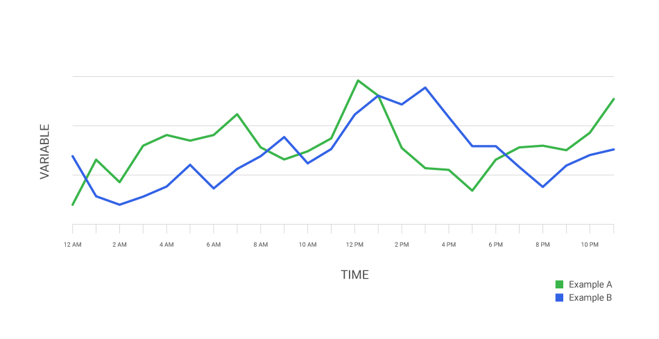

# Gestion des métriques

Contrairement aux logues qui sont des informations laissé par un système, les métriques sont des mesures que nous faisons sur le système afin d'évaluer son niveau de *santé*.

## Les 4 signaux d'or

Il existe 4 catégories de métriques. Lorsqu'un service dans un réseau a un problème rencontré par un client, il est important de pouvoir visualiser **au moins** **une métrique par signal** pour **chaque services**.

- **Latence**
  - Le temps qu'uue requête à un service prend
    - Par exemple: Si votre service retourne des erreurs 500 lorsqu'il reçoit une requête HTTP et que la **latence est basse** (la requête retourne une erreur 500 très rapidement), ce n'est probablement pas le même problème que si votre service retourne des erreurs 500 mais que la **latence est haute**.
    - Dans cet exemple, une latence basse pourrait signaler qu'une dépendance du service n'est pas *up* (par exemple une base de données), tandis qu'une latence élevé pourrait indiquer un problème bien plus grave.
    - C'est pourquoi il est primordiale de **mesurer la latence des erreurs**
- **Trafique**
  - Mesure la demande pour un service données.
    - ex: Taux de requête HTTP, taux de trafique réseau I/O, nombre de transaction dans une base de données, nombre de connexion ou de client connecté à un service.
- **Erreurs**
  - Le taux de requêtes qui cause des erreurs.
    - ex: Taux de requêtes qui échouent explicitement (erreurs 500)
- **Saturation**
  - À quel point un service donnée est à pleine capacité (100%).
  - ex:
    - mémoire vive
    - mémoire de stockage
    - capacité du CPU
    - nombre de connection
  - Il est important de comprendre que la majorité des services vont se dégrader avant même d'atteindre le 100%. Donc dans le chapitre sur les alertes, il sera important de se doter d'une cible de capacité dont le service ne doit pas dépasser
    - ex:
      - capacité de la base de données ne doit pas dépasser 80% car au delà de ce seuil, le temps de réplication augmente rapidement et ralentit considérablement la base de données
      - la mémoire vive ne doit pas dépasser le seuil de 90% car sinon le *swappiness* (conversion de mémoire vive en mémoire dur) consomme trop de ressources
  - Ce signal permet aussi de faire des prédictions sur les saturations futures.
    - Par exemple: déterminer qu'avec le taux actuel de données qui sont écrient dans la base de données, celle-ci sera pleine dans 4h

## Essence vs phénomène

Lors du diagnostique, les 4 signaux permettent d'apporter plusieurs dimensions à la problématique et permet d'écarter les **phénomènes** et de pouvoir cerner l'**essence** du problème.

### Phénomènes

Problématiques secondaire causé par la racine du problème. Exemple, de la **latence causé par une saturation**.

### Essence

La racine du problème et des phénomènes qui en découle. Exemple, un système qui est *down* qui a causé de la latence sur les autres services du réseau.

Exemple:

Une application peut avoir des erreurs 500 (signal d'erreurs), mais ce n'est qu'un **phénomène** causé par une augmentation du temps des requêtes HTTP à un API (signal latence) qui cause un *timeout*. Cette latence peut elle aussi être un **phénomène** causé, par exemple, par une saturation d'un service de base données dans le réseau qui serait dans ce cas-ci l'**essence** de la problématique.

Donc, la dépendance des divers problème rencontrer serait le suivant:

Base de données saturé (**essence**) → Latence de l'API (**phénomène**) → Erreur 500, *timeout* (**phénomène**)

## Série temporelle

Lors de dépannage d'un service, une mesure faite sur l'application (métrique) en soit ne donnera probablement pas assez d'information. Par exemple, si un service a problème de latence et que vous voyez le nombre de requêtes par minute est de 100 requêtes par minute, il est difficile de déterminer si c'est élevé ou non.

La mesure d'une métrique a besoin de **contexte** afin d'avoir du sense. On arrive a donner un contexte et un sense à une métrique lorsqu'on collecte plusieurs fois fois la métrique dans le temps afin de pouvoir déterminer une tendance. Cette prise chronologique de mesure se nomme [série temporelle](https://fr.wikipedia.org/wiki/Série_temporelle) et c'est ce qui permet de découvrir des tendances sur notre systèmes qui peuvent mener à des incidents.



## *Prometheus*

Il existe plusieurs outil permettent de récolter et centraliser les métriques de divers services. Par exemple, la fonction publique utilise [Microsoft Power BI](https://www.microsoft.com/en-us/power-platform/products/power-bi/), ou une grosse compagnie qui n'utilise pas microsoft utilisent souvent [Datadog](https://www.datadoghq.com).

Datadog est très dispendieux et PowerBI ne fonctionne que sur microsoft, donc dans le cadre du cours, nous allons utiliser [Prometheus](https://prometheus.io). Cet outil a l'avantage de fonctionner sur tous le systèmes d'exploitations, d'être *open source* et de pouvoir le *self-host* soit même (par exemple via Docker 😉).

## *PromQL*

Tout comme *Loki*, *Prometheus* centralise les métriques de plusieurs sources différentes. Donc, il est important d'être capable de filter ce qui est pertinent comme par exemple lors d'un incident. Avec *prometheus*, il est possible de faire des requêtes sur les métriques en utilisant le *PromQL*.

### Types

- Vecteur d'instant - Un ensemble de données temporelles contenant les mesures ayant tous le même temps
- Vecteur de plage - Un ensemble de données temporelles contenant les mesures d'une plage de temps données
- Scalaire - Une valeur numérique simple

### *Instant vector* (vecteurs d'instant ?)

Représente dans sa plus simple formes toutes les valeurs d'une métrique à un instant *t*. C'est le résultat qu'on obtient lorsqu'on fait une requête avec **seulement le nom d'une métrique**. Par exemple:

```promQL
express_http_request_total
```

Cette requête retourne toutes les séries temporelles de la métrique `express_http_request_total`. Il y aura **une série pour chaque combinaison d'étiquette**.

Tout comme les logues, il est possible de filter les données temporelles en fonction de leurs étiquettes en utilisant des sélecteurs dans des `{}`. Par exemple:

```promQL
express_http_request_total{method="GET", status_code="200"}
```

Cette requête retourne les séries ayant la valeur `GET` pour l'étiquette `method` et la valeur `200` pour l'étiquette `status_code`.

Tout comme le `logQL`, il est possible de faire les opérations booléennes suivantes sur les étiquettes:

- `=` : l'étiquette possède exactement la valeur du sélecteur
- `!=` : l'étiquette ne possède pas la valeur du sélecteur
- `=~` : l'étiquette correspond à l'expression régulière du sélecteur
- `!~` : l'étiquette ne correspond pas à correspond à l'expression régulière du sélecteur

Par exemple:

```promQL
express_http_request_total{method!="GET", status_code!~"2[0-9]{2}"}
```

Cette requête retournes toutes les séries qui ne sont pas associées à la méthode `GET` (donc toutes les autres méthodes HTTP) et n'ont pas retourne de code de type 200 (signifiant que la requête a bien fonctionné).

### *Range Vector* (vecteur de plage?)

Permet de sélectionner un vecteurs de série en fonction du nombre d'unité de temps que la mesure a eu lieu. Permet donc de filter en fonction du temps. Pour ce faire, on spécifie le lapse de temps à l'intérieur de crochet (`[]`). Par exemple:

```promQL
express_http_request_total{method="GET", status_code="200"}[5m]
```

Cette requête retourne une ou des séries avec des données qui datent d'**il y a 5 minutes jusqu'à l'instant présent**.

Voici toutes les unités de temps supportées:

- ms – millisecondes
- s – secondes – 1s égale 1000ms
- m – minutes – 1m égale 60s (ignorant les secondes intercalaires)
- h – heures – 1h égale 60m
- d – journées – 1d égale 24h (ignorant l'heure avancé)
- w – semaines – 1w égale 7d
- y – années – 1y égale 365d (ignorant la journée intercalaire (29 février))

### Opérateurs

Les opérateurs suivant sont valide en `promQL`:

- `+` (addition)
- `-` (soustraction)
- `*` (multiplication)
- `/` (division)
- `%` (modulo)
- `^` (exposant)

Les opérateurs peuvent se faire seulement entre:

- un scalaire et un scalaire
- un vecteur et un scalaire
- un vecteur et un vecteur

Les comparaisons booléennes suivante sont valide en `promQL`:

- `==`
- `!=`
- `>`
- `<`
- `>=`
- `<=`

Le résultat de la comparaison est soit `0` pour *faux* ou `1` pour *vrai*.

### Fonctions

Le `promQL` [a plusieurs fonctions](https://prometheus.io/docs/prometheus/latest/querying/functions/) qui permettent de faire des transformations supplémentaires à nos séries temporelles.

Les plus utilisées à mon avis:
- `rate`: particulièrement intéressant pour faire des métriques de trafique. 
- `clam`: Permet de mettre des bornes max et min sur la série.
- `<aggregation>_over_time`: Surtout `avg`, `min` et `max`.
- `sum`: s'explique de soi-même.